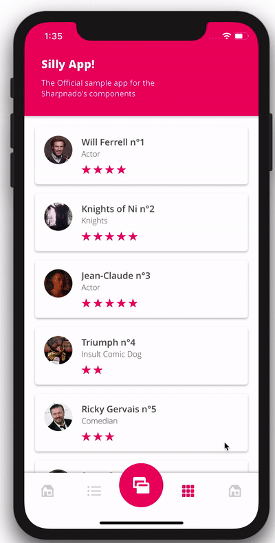

# Sharpnado's Silly Sample App!

Sample app for the following libraries:

* https://github.com/roubachof/Sharpnado.Presentation.Forms
* https://github.com/roubachof/Sharpnado.Tabs
* https://github.com/roubachof/Sharpnado.MaterialFrame
* https://github.com/roubachof/Sharpnado.TaskLoaderView
* https://github.com/roubachof/Sharpnado.Shadows

| Platform | Build Status                                                                                                                             |
| -------- | ---------------------------------------------------------------------------------------------------------------------------------------- |
| Android  |  |
| iOS      |  |

## Including

* HorizontalListView
* Tabs
* MaterialFrame
* TaskLoaderView 2.0
* Paginator

## Important

The `Sharpnado.Presentation.Forms`, `Sharpnado.Tabs` and `Sharpnado.MaterialFrame` are added as git submodules.
Run the following command after cloning the repository to be up and running:

`git submodule update --init`

## Screenshots

<table>
  <thead>
    <tr>
      <th>iOS Neumorphism</th>
      <th>UWP Neumorphism badges</th>
    </tr>
  </thead>
  <tbody>
    <tr>
      <td></td>
      <td></td>
    </tr>
  </tbody>
</table>

<table>
  <thead>
    <tr>
      <th>iOS Theming </th>
      <th>Android Theming</th>
    </tr>
  </thead>
  <tbody>
    <tr>
      <td></td>
      <td></td>
    </tr>
  </tbody>
</table>
